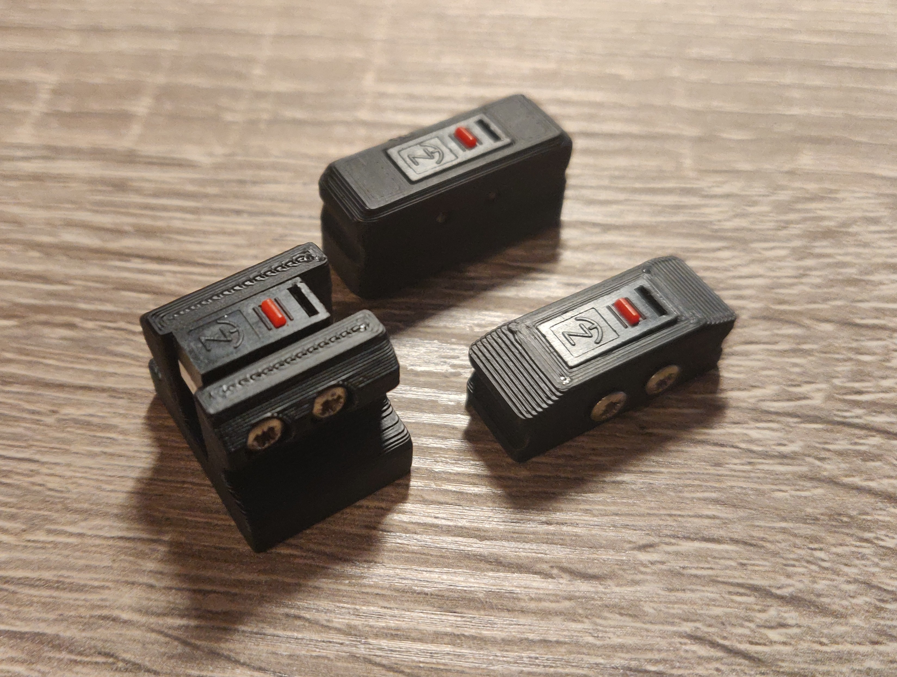
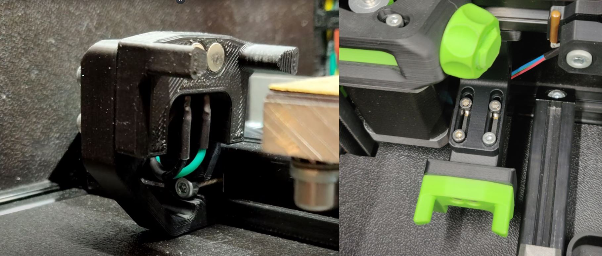
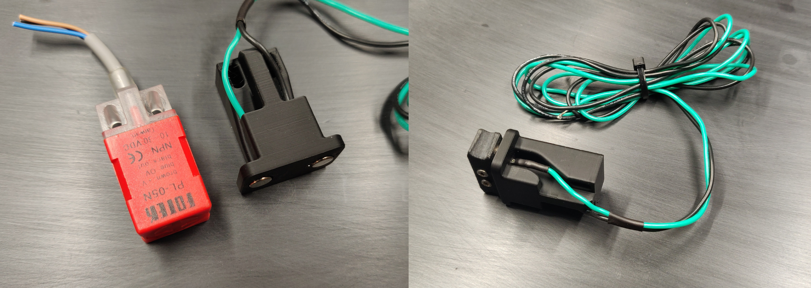
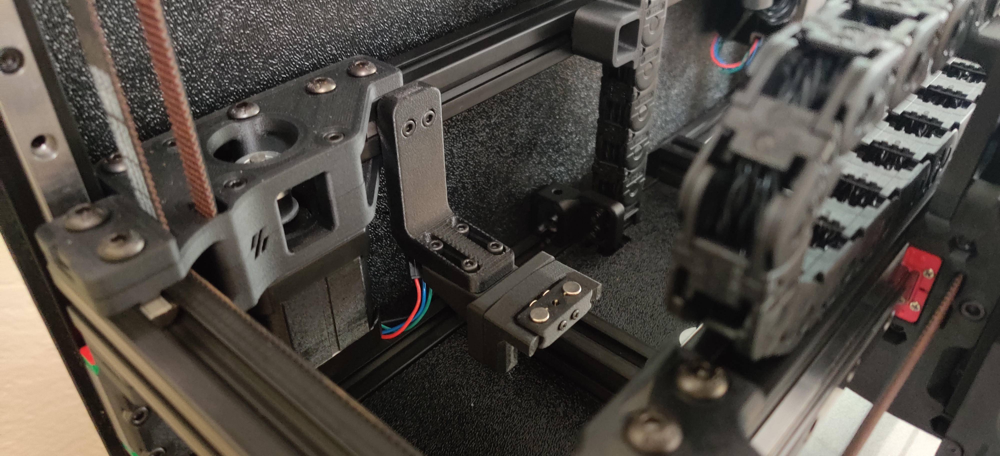
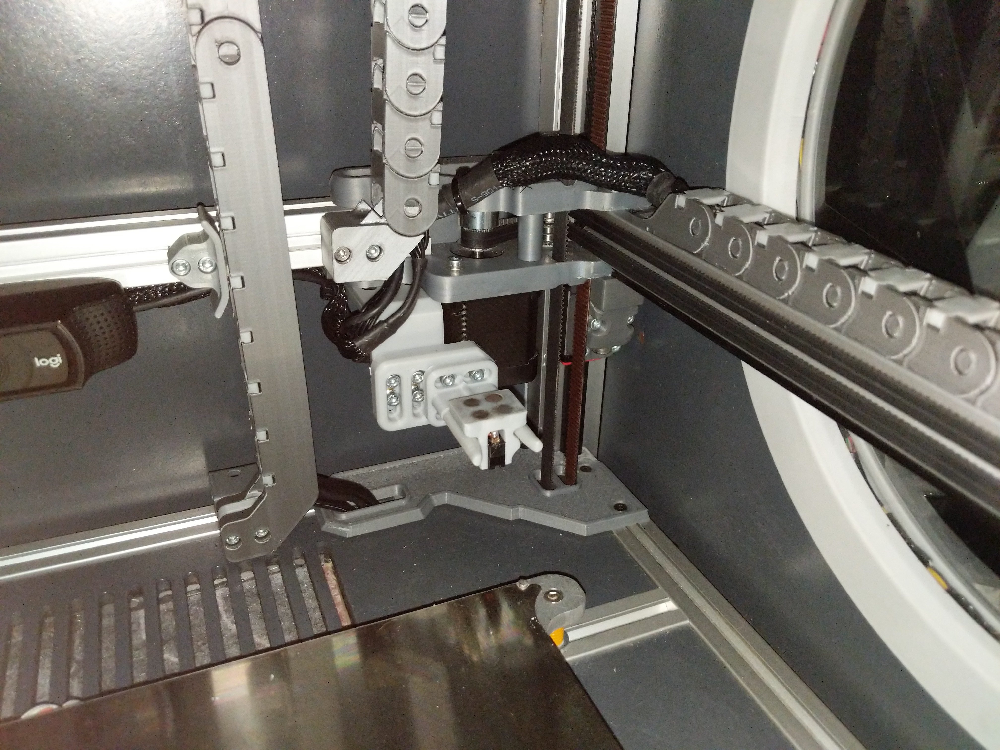

# The Quickdraw Probe: A Magneticly Coupled, Microswitch Driven, Z Probe

## What is it?
Summarized the [magprobe](/STLs/omron_d2f-5_microswitch_probe_body_x1_rev3.STL) is a microswitch that can dock and undock on the toolhead of your printer. It touches the surface to make measurements. The magprobe has evolved a lot over time. Initially started as idea to keep a printer with broken inductive going with a cheap fix. Mental took [the first steps](https://www.youtube.com/watch?v=-VpZTDSu1-8) to adapt it to a V2. Many branches rolled out of this design like the [Piton probe.](https://github.com/Annex-Engineering/Annex_Engineering_PCBs/tree/master/piton_probe)

Currently the magprobe is a lot smaller, completely <u>solderless</u>, <u>requires no custom PCB's</u> and has software for automatic docking and undocking with failsafes. You can mount the [dock](https://github.com/Annex-Engineering/Quickdraw_Probe/tree/main/STLs) on the bed or to the gantry. Mounting to the bed is more hidden but is more sensitive to misalignment. Many machines are already supported like the K1, K2, K3, V0, V1, V2, Legacy and Switchwire. Even more when you count in the mods that are made by other people.

Testing has shown the best switch for repeatability is the Omron D2F-5. You can also order the 5L model and remove the lever. A high temp substitute can be the Honeywell 411SX21-T. Downsides are is that its a lot more expensive and performs the same or worse. A genuine Omron D2F-5 should get you easily 1000H of use. Replacing the magprobe in your machine is a matter of seconds.

Video of magprobe [in action.](https://www.youtube.com/watch?v=kHAcm8c9pTk)

## Drop in replacement for PL-08N2 and similar
If you want to test the [magprobe](/STLs/omron_d2f-5_microswitch_probe_body_x1_rev3.STL) quickly there is a [drop in replacement](/STLs/PL08N_Drop-in_Replacement/direct_microswitch_replacement_inductive.STL) for the PL-08N2 and similar. We recommend to always use the carriages with baked in magprobe support. The magprobe will be closer and aligned to the nozzle, total weight lower, magnets further away from the buildplate and often comes with a bigger hotend cooling exhaust.

## Software
It is recommended to run Klipper (https://github.com/KevinOConnor/klipper). It is recommended to use the [integrated klipper module.](https://github.com/mental405/klipper/blob/work-annex-probe/docs/Dockable_Probe.md) A final merge is pending.

## General installation instructions

You can find a full step-by-step Youtube assembly video [here.](https://www.youtube.com/watch?v=zLjfP3BHAIw)

## Gallery

Magprobe from Discord user yhaiovyi

Magprobe from Discord user [mental](https://www.youtube.com/watch?v=dCkJHvA7i6I)

## Toolheads with baked in magprobe support
- [K1](https://github.com/Annex-Engineering/Masherbrum-K1)
- [K2](https://github.com/Annex-Engineering/Chhogori-K2-Summit-Edition)
- [K3](https://github.com/Annex-Engineering/Gasherbrum-K3)
- [V2](https://github.com/Annex-Engineering/Annex-Engineering_User_Mods/tree/main/Misc/Quickdraw/annex_internal-Probe_Docks_for_Non-Annex_Printers/VORON_V2.4)
- [Switchwire](https://github.com/Annex-Engineering/Annex-Engineering_User_Mods/tree/main/Misc/Quickdraw/annex_internal-Probe_Docks_for_Non-Annex_Printers/VORON_SW/STLs)
- [Legacy](https://github.com/Annex-Engineering/Annex-Engineering_User_Mods/tree/main/Misc/Quickdraw/annex_internal-Probe_Docks_for_Non-Annex_Printers/VORON_Legacy/STLs)

## Support
If you need help assembling or have any other questions you are more them welcome in our Discord server. You can join us through this link here: https://discord.gg/MzTR3zE

